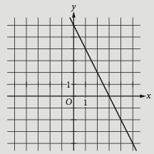

# SAT Prep Unit 1: Heart of Algebra

## Lesson 1.8 Graphing systems of equations

Wednesday 21 September 2022

### Solve the problem, then compare your answer with the classmate seated next to you.

Do Now: 

1. Solve this _system_ of equations
$2y+6x=3$
$y+3x=2$
How many solutions $(x,y)$ are there to the system of equations above?
    1. Zero
    1. One
    1. Two
    1. More than two
$\\[0.5cm]$

Hint: There are multiple ways to solve a system: calculate/guess, make a data table, eliminate a variable, substitute a variable, graph the system.

$\\[0.5cm]$
Lesson: The Relationships Among Linear Equations, Lines in the Coordinate Plane, and the Contexts They Describe
Homework: Practice systems of equations SAT practice problems in Khan Academy
__________

### Systems of equations

The point of intersection gives the solution to the system.

If the equations in a system of two linear equations in two variables are
graphed, each graph will be a line. There are three possibilities:
* The lines intersect in one point. In this case, the system has a unique solution.
* The lines are parallel. In this case, the system has no solution.
* The lines are identical. In this case, every point on the line is a solution,
and so the system has infinitely many solutions.

__________

### What we know about graphs of linear equations

* To graph, rearrange equations into $y–mx+b$ form and use a graphing calculator.
* Two lines are parallel if they have the same slope.
* Two lines are perpendicular if the product of their slopes is –1.
* For contextual situations, the slope is the rate of change, and the y-intercept is often the starting point.

__________

### Practice problems

1. $\hspace{0.3cm}$ $3s−2t=a$
$–15s + bt = −7$

In the system of equations above, a and b are constants. If the system has Example 13

$\\[3cm]$

__________

2. The graph of line $k$ is shown in the $xy$-plane above. Which of the following is an equation of a line that is perpendicular to line $k$?
A) $y = −2x + 1$ 
B) $y = − \frac{1}{2} x + 2$
C) $y = \frac{1}{2} x + 3$
D) $y = 2x + 4$

__________

3. A voter registration drive was held in Town $Y$. The number of voters, $V$, registered $T$ days after the drive began can be estimated by the equation $V = 3,450 + 65T$. What is the best interpretation of the number 65 in this equation?
A. The number of registered voters at the beginning of the registration drive
B. The number of registered voters at the end of the registration drive
C. The total number of voters registered during the drive
D. The number of voters registered each day during the drive

__________

4. $9x–14y= – 3$
$2x – ay = – 6$

What value of a will result in a system with no solutions?
