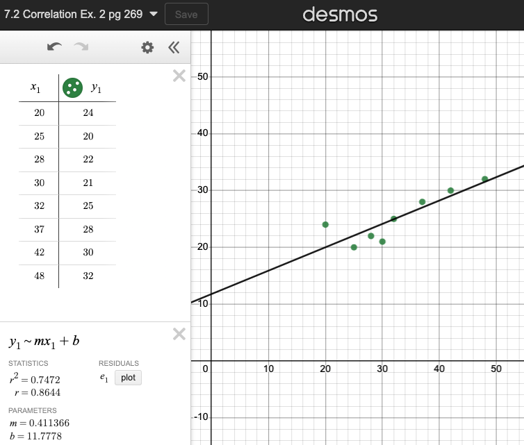

<!-- slide -->
$\hspace{5cm}$ Tuesday 3 January

### 7.1 Bivariate data

- Learning Target: I can use scatter plots to compare two variables
- Do Now: Estimate the mean, median, mode of math grades
- Lesson: Evaluating correlation graphically
- Homework: Khan Academy statistics unit due Friday

<!-- slide -->

### Correlation is not causation

- Introduction to bivariate data: textbook pages 133-138
  - Two variables ($x$ and $y$)
  - Independent variable (horizontal axis)
    - e.g. time, distance, number
  - Dependent variable (vertical axis)
    - height, money, result

<!-- slide -->

$\hspace{5cm}$ Wednesday 4 January

### 7.2 Pearson's correlation coefficient $r$

- Learning Target: I can estimate correlation
- Lesson: Quantifying linear fit, pages 262-273

<!-- slide -->

#### STEM Correlation (Example 2 p269)

Eight students' course results

| Course | 1 | 2 | 3 | 4 | 5 | 6 | 7 | 8 |
| --- | --- | --- | --- | --- | --- | --- | --- | --- |
| Math (y) | 20 | 25 | 28 | 30 | 32 | 37 | 42 | 48 |
| Biology (x) | 24 | 20 | 22 | 21 | 25 | 28 | 30 | 32 |

[Desmos link](https://www.desmos.com/calculator/kbjsrfa0hc)

<!-- slide -->

<!-- slide -->

$\hspace{4cm}$ Thursday 5 January

### 7.3 Quartiles, IQR

- Learning Target: I can compute the five-figure summary
- Do Now: Example 3a page 101
- Lesson: Calculator summary statistics, pages 106-112
- SAT practice test Thursday

<!-- slide -->

$\hspace{4cm}$ Monday 9 January

### 7.4 SAT Practice test

- with calculator
- Multiple choice questions 1 - 30
- Whole period (actual test is 38 problems in 55 minutes)

<!-- slide -->

$\hspace{4cm}$ Tuesday 10 January

### 7.5 Review SAT practice test

- Learning Target: I can learn from my mistakes
- Do Now: Solve a system by graphing
- Lesson: Students work problems from exam

<!-- slide -->

$\hspace{4cm}$ Wednesday 11 January

### 7.6 Quartiles, IQR

- Learning Target: I can compute the five-figure summary
- Do Now: Example 3a page 101
- Lesson: Calculator summary statistics, pages 106-112
- SAT practice test Thursday

<!-- slide -->

$\hspace{4cm}$ Thursday 12 January

### 7.7 SAT Practice test

- with calculator
- Multiple choice questions 1 - 30
- Whole period (actual test is 38 problems in 55 minutes)