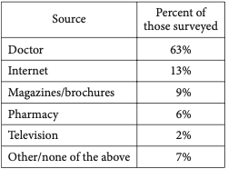

### Practice problems

1. The members of a city council wanted to assess the opinions of all city residents about converting an open field into a dog park. The council surveyed a sample of 500 city residents who own dogs. The survey showed that the majority of those sampled were in favor of the dog park. Which of the following is true about the city council’s survey?

A) It shows that the majority of city residents are in favor of the dog park.
B) The survey sample should have included more residents who are dog owners.
C) The survey sample should have consisted entirely of residents who do not own dogs.
D) The survey sample is biased because it is not representative of all city residents.

2. Where Do People Get Most of Their Medical Information?

The table above shows a summary of 1,200 responses
to a survey question. Based on the table, how many
of those surveyed get most of their medical
information from either a doctor or the Internet?

A. 865
B. 887
C. 912
D. 926
