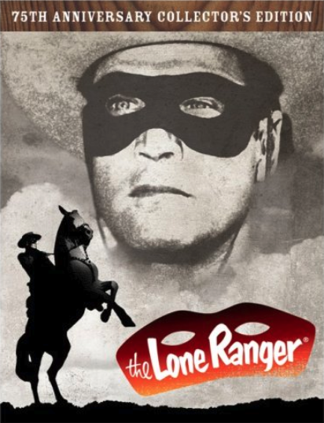

<!-- slide -->

The Lone Ranger: [William Tell Overture](https://www.popisms.com/Song/5474/William-Tell-Overture-Gioachino-Rossini-1829)

<!-- slide -->

What is the result of dividing the circumference 

of a pumpkin by its diameter?

<!-- slide -->

What is the circumference of a pumpkin divided by its diameter?

*Pumpkin* $\, \large \pi$!

<!-- slide -->

[Ode to Joy](https://twitter.com/i/status/1581055777896161280)

[Lang Lang classical piano](https://twitter.com/TansuYegen/status/1596807427717931008)